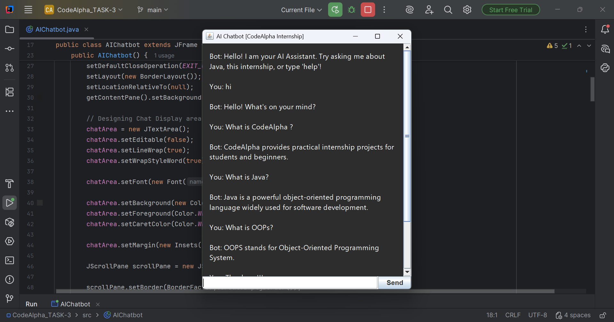

# 🚀 CodeAlpha Summer Internship 2026 - Portfolio

Welcome to my internship portfolio! This monorepo contains multiple robust Java-based applications developed as part of the CodeAlpha Summer Internship Program. It demonstrates a progression of core concepts including **Object-Oriented Programming (OOP), GUI development, Data Structures, and basic Natural Language Processing (NLP)**.

---

## 👨‍💻 About Me
* **Name:** Niraj Kumar Rana
* **Domain:** Computer Science & Engineering (CSE)
* **Focus:** Java Development, Application Architecture, and Problem Solving

---

## 📌 Projects Included

### 🤖 1. Artificial Intelligence Chatbot
A real-time interactive chatbot that bridges core programming logic with AI simulation.
* **Architecture:** [cite_start]Designed with a centralized controller to separate UI rendering from logical processing[cite: 30, 31].
* **GUI Integration:** [cite_start]Features a sleek desktop interface built with Java Swing, including a scrollable chat area and dynamic input field[cite: 25].
* **NLP Preprocessing:** [cite_start]Implements text normalization to strip punctuation and convert input to lowercase, ensuring user intent is captured regardless of grammar[cite: 26].
* **Rule-Based Intelligence:** [cite_start]Powered by a robust `HashMap` dictionary that extracts core keywords to fetch and deliver the most relevant FAQ responses[cite: 27, 28].
# 📷 Screenshot

### 📊 2. Student Grade Tracker
A streamlined grading environment to compute, manage, and report academic data.
* **Dynamic Data Management:** [cite_start]Utilizes `ArrayLists` to dynamically store and manage multiple `Student` objects without strict size limits[cite: 161].
* **Automated Computation:** [cite_start]Automatically tracks running sums and compares data to output the class average, highest score, and lowest score[cite: 163].
* **Robust Input Validation:** [cite_start]Features nested loops and error handling to ensure entered grades remain within valid bounds (0-100), preventing application crashes[cite: 162].

### 📈 3. Stock Trading Platform (Simulation)
A simulated financial ecosystem tracking virtual wallets, market volatility, and asset management.
* **Dynamic Market Simulation:** [cite_start]Features realistic price fluctuations mimicking real-world stock market volatility[cite: 310].
* **Trade Execution Logic:** [cite_start]Real-time validation prevents users from buying with insufficient funds or selling unowned shares[cite: 311].
* **Object-Oriented Design:** [cite_start]Strictly adheres to OOP principles to manage modular classes for users, holdings, and transaction ledgers[cite: 316].

### 🏨 4. Hotel Reservation System
A modular booking system managing real-time inventory and simulating payment gateways.
* **Dynamic Room Browsing:** [cite_start]Allows users to search and view available rooms categorized by standard, deluxe, and suite types[cite: 149].
* **Payment Simulation:** [cite_start]Validates virtual funds prior to booking confirmation and automatically calculates change[cite: 151].
* **Data Persistence:** [cite_start]Initially implemented using file I/O to maintain booking states across application runs, acting as a precursor to full database integration[cite: 256, 262].

---

## 🛠 Tech Stack

* **Language:** Java (JDK 17+)
* **Core Paradigms:** Object-Oriented Programming (OOP), Data Structures (`HashMap`, `ArrayList`)
* **Interfaces:** Java Swing (GUI), Console UI
* **Logic Elements:** Basic NLP (Regex Text Normalization, Pattern Matching)
* **Version Control:** Git & GitHub

---

## 📚 Learning Outcomes

* **Software Logic & UX:** [cite_start]Mastered the intersection of software logic and user experience through responsive Swing interfaces[cite: 39].
* **String Manipulation:** [cite_start]Implemented regex-based NLP techniques for raw data cleaning[cite: 40].
* **System Design:** [cite_start]Transitioned through application architectures, maintaining a clean separation of concerns for enterprise-ready modularity[cite: 156].
* **Workflow:** Improved Git & GitHub version control and repository management.

---

## 📫 Contact & Links

* **GitHub:** [nirusan3494](https://github.com/nirusan3494)
* **Email:**nirana1100@gmail.com
* **Developed With ❤️ as part of the CodeAlpha Summer Internship 2026.**
